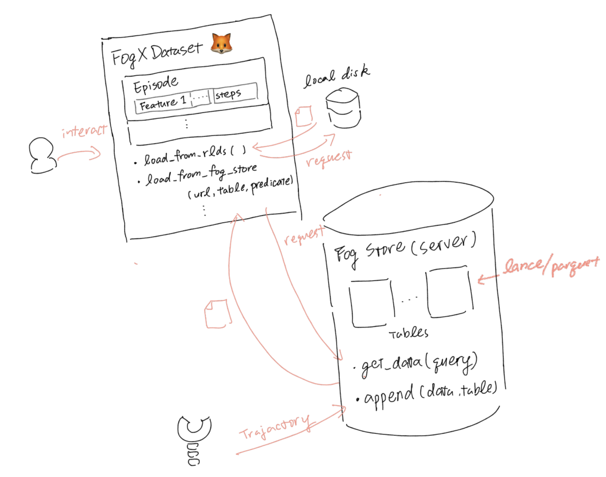

# 🦊 🗃️ FogX-Store 
FogX-Store is a dataset store service that collects and serves large robotics datasets. 

Users of [Fog-X](https://github.com/KeplerC/fog_x/tree/main), machine learning practitioners in robotics, can solely rely on FogX-Store to get datasets from different data source (FogX-Store is the Hub!), and perform analytic workloads without the need to manage the data flow themselves.




## Integration Test

```
docker compose build
docker compose up
```
